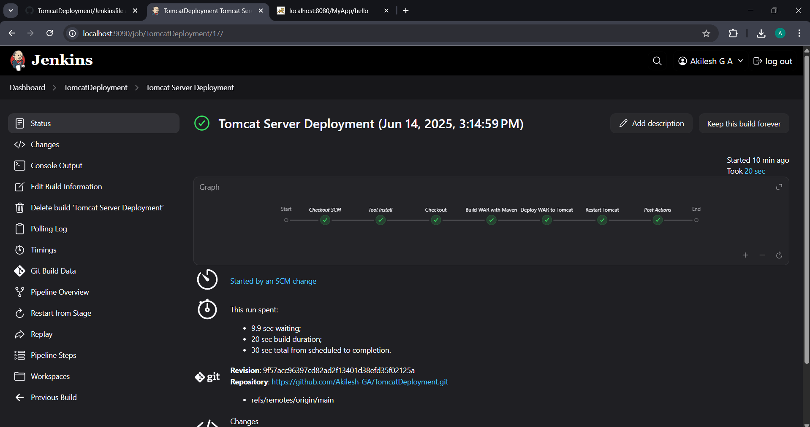
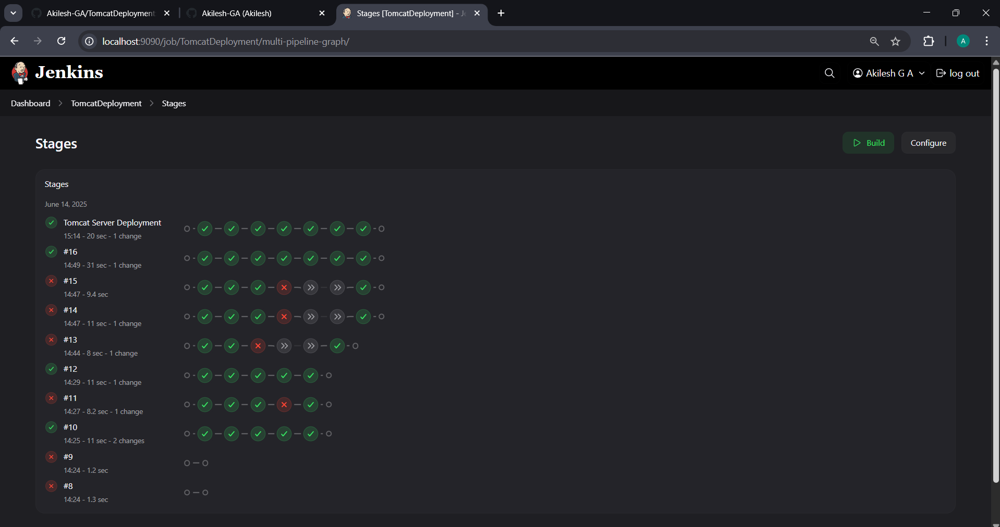

# 🚀 Java Web Application CI/CD Pipeline

## 📌 About The Project
This project implements a complete **CI/CD automation pipeline** for deploying a Java-based web application using industry-standard DevOps tools.  

The pipeline ensures that every code commit is automatically **built, tested, packaged, and deployed** to a Tomcat server — eliminating manual intervention and improving development speed, consistency, and reliability.

## 🛠️ Tech Stack

- **Version Control:** Git & GitHub  
- **Build Tool:** Maven  
- **CI/CD Server:** Jenkins  
- **Application Server:** Apache Tomcat  
- **Infrastructure Provisioning:** Terraform  
- **Cloud Platform:** AWS (EC2)  
- **Programming Language:** Java (Servlet-based Web Application)

## 🔄 CI/CD Pipeline Workflow

1. Developer pushes code to GitHub.
2. Jenkins automatically triggers a build.
3. Maven compiles the source code.
4. Unit tests are executed.
5. WAR file is generated.
6. Application is deployed to Tomcat server.
7. Updated version goes live automatically.

  <h2>📈 PIPELINE GRAPH</h2>
  

  

  <h2>📊 PIPELINE REPORT</h2>
  

  

  <h2>🔍 PIPELINE STAGES</h2>
  

## 🎯 Key Features

- Automated build and deployment process
- Continuous integration on every commit
- Infrastructure as Code using Terraform
- Zero manual deployment steps
- Faster release cycles
- Reduced deployment errors
- Scalable and production-ready setup
